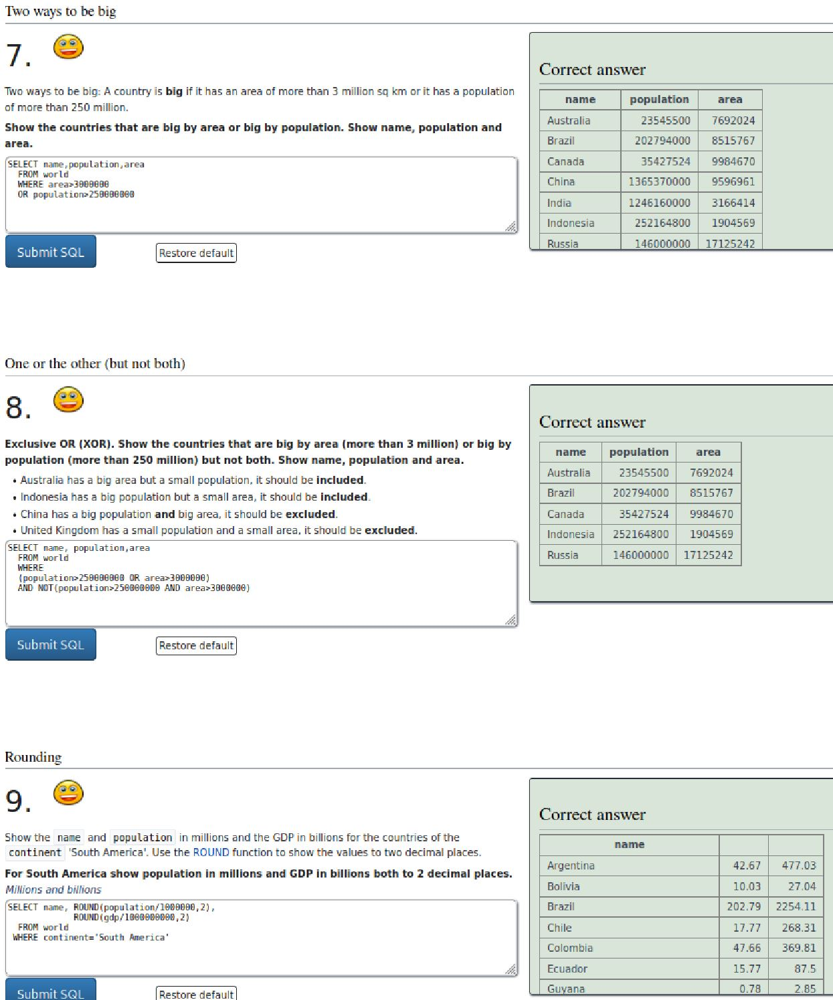

# InfoSec_h2

x) Read and summarize (This subtask x does not require tests with a computer. Some bullets per article is enough for your summary, feel free to write more if you like)
+ OWASP: OWASP 10 2021
    * A05:2021-Security Misconfiguration

Security Misconfiguration is a vulnerability that occurs when security settings on systems and applications are not properly configured, allowing unauthorized access to sensitive information. The most common causes of security misconfigurations are:

   - Default configurations: Applications and systems often come with default configurations that are not secure.

   - Incorrect configurations: Misconfigurations can occur when changes are made to the system or application without fully understanding the implications of the changes.

   - Incomplete configurations: Some systems or applications may not be fully configured, leaving certain security settings incomplete.

   - Outdated configurations: Systems and applications can become vulnerable over time if security configurations are not kept up to date.

   - Lack of maintenance: Security configurations may deteriorate over time due to a lack of maintenance and regular security checks.

It is important to properly configure systems and applications to minimize the risk of security misconfigurations. The best implemention practices would be regularly checking for misconfigurations, and maintaining up-to-date security configurations.

    * A06:2021-Vulnerable and Outdated Components
    * A03:2021-Injection
    * Any episode from Darknet Diaries.
+ Pick a CVE, and briefly explain it & why it matters

### a) Sequel. Solve SQLZoo:
* 0 SELECT basics

* 2 SELECT from World, from first subtask to 5 "France, Germany, Italy"

### b) Injected. Solve WebGoat:
* A1 Injection (intro)

### m) Voluntary bonus: Pick your tasks from SQLZoo 1, 3-9.

### n) Voluntary difficult bonus: WebGoat: SQL Injection (advanced).

## References: 

* https://terokarvinen.com/2023/information-security-2023/?f=moodle
* https://owasp.org/Top10/A05_2021-Security_Misconfiguration/
* https://owasp.org/Top10/A06_2021-Vulnerable_and_Outdated_Components/
* https://owasp.org/Top10/A03_2021-Injection/
* https://darknetdiaries.com/
* https://cvetrends.com/
* https://cve.mitre.org/
* https://news.ycombinator.com/
